# Reproduce the thesis experiments

This guide runs the main, four-style and supplementary designs documented in
the thesis Methodology. Exact settings are in
[STUDY_DESIGN.md](configs/jobs/final_study/STUDY_DESIGN.md).

## Prerequisites and scope

1. Complete [DGX installation](RUNNING.md#one-time-dgx-setup) if needed.
2. Follow [environment, build and services](RUNNING.md#services-and-shell-setup).
3. Use the same code/config revision across hosts. Run one model job at a time
   per shared runtime stack.

These commands use the `RUN_ROOT` configured in `.env`. If you deliberately
select another run directory through the shell, preserve `RUN_ROOT` through
`sudo` as described in [shell setup](RUNNING.md#once-per-terminal-or-tmux-window).
The CLI and analysis use the [documented application formats](RUNNING.md#run-storage-and-reproducibility).

The random main dataset has 90 titles (30 per domain), without illustratability
or title-length quotas. Each title uses two prompt seeds crossed with two image
seeds. Use the shipped dataset; do not redraw it for a new condition.

Every image-dependent study condition persists the same three checks: normalized
reference-title absence in the generated prompt, blind image rejection of any
meaningful readable text, and title-aware image rejection of the reference
title only. The first image policy with Strict Exact Match is primary; the
title-aware and normalized variants are sensitivity outcomes. Verification
affects scoring but never stops generation or reconstruction.
Prompt reconstruction adds one prediction per stored prompt plus domain, with
the prompt check only; image seeds and image policies do not enter that score.

There are **three main jobs and six supplementary job configurations**, plus a
candidate-rating job used for the high-illustratability selection. Direct Core
also supplies the unrestricted condition of the four-style comparison:

| Group | Job config | Design / research question | Prerequisite |
| --- | --- | --- | --- |
| Main | `direct_core.yaml` | 4 x 4 direct; four paired indirect baselines (RQ1, RQ3, SQ4) | services ready |
| Main | `indirect_local.yaml` | 2 x 4 x 2 local indirect (RQ2, SQ4) | services ready |
| Main | `aqueduct_v4_extension.yaml` | 20 additions completing 3 x 4 x 3 (RQ2, SQ4) | exact completed local-indirect job; API key |
| Supplement | `direct_sketch.yaml` | 4 x 4 sketch (SQ1) | services ready |
| Supplement | `direct_comic.yaml` | 4 x 4 comic (SQ1) | services ready |
| Supplement | `direct_photorealistic.yaml` | 4 x 4 photorealistic (SQ1) | services ready |
| Supplement | `direct_thinking.yaml` | 4 x 4 native-thinking comparison (SQ2) | exact completed direct-core job |
| Supplement | `direct_illustratable.yaml` | 4 x 4 selected-title comparison (SQ3) | completed ratings, selection and runner rebuild |
| Supplement | `direct_prompt_only.yaml` | 4 x 4 prompt/direct and four-diagonal three-way comparison (SQ5) | confirmed free style; exact completed direct-core source |

RQ1–RQ3 are primary research questions; SQ1–SQ5 are secondary research
questions. SQ4 compares title domains using the main jobs, without an
additional experiment. The main/supplementary job grouping describes execution,
not question priority.

All job configs above are under `configs/jobs/final_study/`. Only the high-illustratability
reconstruction job depends on the candidate ratings. The high-illustratability
dataset is a supplement, not a replacement for the random main sample.

Complete the four-style report and obtain common-style confirmation before
the remaining style-dependent main and supplementary jobs. The shipped
configuration uses unrestricted generation; a different confirmed choice
requires explicitly aligned profiles and source bindings before execution.



[Editable Mermaid source](diagrams/study_jobs.mmd). The arrows mark data or
baseline dependencies; independent jobs do not need to run in the illustrated
order.

`job start` validates, creates a snapshot and runs in the foreground. Save its
printed Job ID. Use [resume](RUNNING.md#monitor-and-resume), not another start,
for an interrupted job. `job plan` is an optional read-only overview: replace
`start` with `plan` and keep the same config/source arguments.

## Job IDs and source paths

List completed jobs:

```bash
sudo docker compose --env-file .env \
  -f compose.yaml -f compose.dgx.yaml -f compose.status.yaml \
  --profile runner --profile status run --rm runner \
  semantic-roundtrip job list --root runs --status completed
```

Choose the exact matching **Job ID**, not a child-run ID or full path. If missing,
run the source job first or copy its complete directory, including child runs,
from the other DGX into this host's `RUN_ROOT`. No source is chosen automatically.

## Main experiments

Direct Core and Local Indirect are independent. Aqueduct follows its completed
Local Indirect source. Independent DGXs can execute separate branches.

### Direct core

```bash
sudo docker compose --env-file .env \
  -f compose.yaml -f compose.dgx.yaml -f compose.status.yaml \
  --profile runner --profile status run --rm runner \
  semantic-roundtrip job start \
  --config configs/jobs/final_study/direct_core.yaml
```

### Local indirect

```bash
sudo docker compose --env-file .env \
  -f compose.yaml -f compose.dgx.yaml -f compose.status.yaml \
  --profile runner --profile status run --rm runner \
  semantic-roundtrip job start \
  --config configs/jobs/final_study/indirect_local.yaml
```

### Aqueduct

Needs the API key loaded from `.env` in [shell setup](RUNNING.md#once-per-terminal-or-tmux-window) and the completed Local Indirect
Job ID:

```bash
read -r -p "Completed final_indirect_local Job ID: " INDIRECT_JOB_ID
```

Then start the extension:

```bash
sudo --preserve-env=AQUEDUCT_API_KEY docker compose --env-file .env \
  -f compose.yaml -f compose.dgx.yaml -f compose.status.yaml \
  --profile runner --profile status run --rm -e AQUEDUCT_API_KEY runner \
  semantic-roundtrip job start \
  --config configs/jobs/final_study/aqueduct_v4_extension.yaml \
  --source-job "local_indirect=runs/${INDIRECT_JOB_ID:?Enter the Local Indirect Job ID first}"
```

## Four-style comparison and supplementary experiments

Direct Core is the unrestricted 4 x 4 condition. Photorealistic, Sketch and
Comic use separate complete 4 x 4 matrices on the same titles and four seed
combinations. Thinking imports the four unchanged Q25/G3 cells from Direct Core
and executes the twelve changed cells.

### Photorealistic

```bash
sudo docker compose --env-file .env \
  -f compose.yaml -f compose.dgx.yaml -f compose.status.yaml \
  --profile runner --profile status run --rm runner \
  semantic-roundtrip job start \
  --config configs/jobs/final_study/direct_photorealistic.yaml
```

### Sketch

```bash
sudo docker compose --env-file .env \
  -f compose.yaml -f compose.dgx.yaml -f compose.status.yaml \
  --profile runner --profile status run --rm runner \
  semantic-roundtrip job start \
  --config configs/jobs/final_study/direct_sketch.yaml
```

### Comic

```bash
sudo docker compose --env-file .env \
  -f compose.yaml -f compose.dgx.yaml -f compose.status.yaml \
  --profile runner --profile status run --rm runner \
  semantic-roundtrip job start \
  --config configs/jobs/final_study/direct_comic.yaml
```

### Thinking

First enter the completed Direct Job ID. Run the input command by itself and
answer the prompt before continuing:

```bash
read -r -p "Completed final_direct_core Job ID: " DIRECT_JOB_ID
```

Then start Thinking; it reuses the unchanged Q25/G3 cells:

```bash
sudo docker compose --env-file .env \
  -f compose.yaml -f compose.dgx.yaml -f compose.status.yaml \
  --profile runner --profile status run --rm runner \
  semantic-roundtrip job start \
  --config configs/jobs/final_study/direct_thinking.yaml \
  --source-job "direct_base=runs/${DIRECT_JOB_ID:?Enter the Direct Job ID first}"
```

### Illustratable dataset

This supplementary dataset does not replace the random main dataset. Its
900-candidate pool is already present. Four models rate each candidate once:
3,600 planned ratings, no image generation.

The completed source job and its model-free distribution analysis are included
in [the candidate-rating archive](artifacts/candidate_illustratability/README.md).
The sequence below reruns inference on the DGX; the archive needs no rerun to
inspect the ratings. Archived evidence is not bundled into the runner image.

For the shipped study inputs, both selected dataset YAMLs and selection CSVs
already exist; no rating rerun or reselection is necessary. To use these
datasets, continue with Step 4. Steps 1–3 reproduce rating inference and
selection. The stored rating job used by the distribution notebook is under
`artifacts/candidate_illustratability/current/jobs/`; its source identifiers,
raw responses and reporting evidence are provided with the data.

#### Step 1 — Run the rating job

Skip only if you already have its completed job for this study.

```bash
sudo docker compose --env-file .env \
  -f compose.yaml -f compose.dgx.yaml -f compose.status.yaml \
  --profile runner --profile status run --rm runner \
  semantic-roundtrip job start \
  --config configs/jobs/final_study/candidate_illustratability.yaml
```

**Wait until all four rating runs are completed.** Save the printed Job ID.
Do not run the selector while ratings are still running.

#### Step 2 — Choose that completed job

```bash
sudo docker compose --env-file .env \
  -f compose.yaml -f compose.dgx.yaml -f compose.status.yaml \
  --profile runner --profile status run --rm runner \
  semantic-roundtrip job list --root runs --status completed
```

Find `candidate_illustratability`. If missing, finish step 1 or copy the completed
job from the other DGX. Do not invent a directory. Run this input command by itself
and paste the Job ID:

```bash
read -r -p "Completed candidate_illustratability Job ID: " RATING_JOB_ID
```

#### Step 3 — Select and save the datasets

Run inside Docker. The dataset mount saves outputs in your host checkout, so
removing the temporary container does not remove the generated files:

```bash
sudo docker compose --env-file .env \
  -f compose.yaml -f compose.dgx.yaml -f compose.status.yaml \
  --profile runner --profile status run --rm --no-deps \
  -v "$PWD/configs/datasets:/app/configs/datasets" \
  runner python scripts/datasets/select_illustratable.py \
  --job "runs/${RATING_JOB_ID:?Enter the completed Rating Job ID first}"
```

Expected files in `configs/datasets/`:

- `illustratable_titles_v1.yaml`: 90 final titles;
- `development_illustratable_titles_v1.yaml`: six separate development titles;
- corresponding `*_sources.csv` reports for both datasets.

Selection uses the four-model mean rating, not reconstruction accuracy. If it
fails, stop here. The rating artifacts are read, not modified.

Path distinction: `runs/JOB_ID` is inside the runner; the same job is at
`$RUN_ROOT/JOB_ID` on the DGX host.

#### Step 4 — Rebuild, then start

The runner image must contain the dataset YAMLs selected for this experiment:

```bash
sudo docker compose --env-file .env \
  -f compose.yaml -f compose.dgx.yaml -f compose.status.yaml \
  --profile runner --profile status build runner
```

After a successful build:

```bash
sudo docker compose --env-file .env \
  -f compose.yaml -f compose.dgx.yaml -f compose.status.yaml \
  --profile runner --profile status run --rm runner \
  semantic-roundtrip job start \
  --config configs/jobs/final_study/direct_illustratable.yaml
```

For another DGX, copy all four generated dataset/report files into its
`configs/datasets/` and rebuild its runner. Reuse this selection; do not rate
again to create a different set. Keep the rating job and generated files together.

### Prompt reconstruction and three-way comparison (SQ5)

First complete the four-style report and obtain the professor's common-style
confirmation. The preferred recommendation is unrestricted because it adds no
explicit style constraint, not because of its observed accuracy. This does not
make the generator style-neutral. If another style is confirmed, revisit SQ5
explicitly before starting it; do not mix different-style route inputs.

On an idle model stack, enter the exact completed source Job ID and start SQ5:

```bash
read -r -p "Completed unrestricted Direct Core Job ID: " PROMPT_SOURCE_JOB_ID

sudo docker compose --env-file .env \
  -f compose.yaml -f compose.dgx.yaml -f compose.status.yaml \
  --profile runner --profile status run --rm runner \
  semantic-roundtrip job start \
  --config configs/jobs/final_study/direct_prompt_only.yaml \
  --source-job "direct_base=runs/${PROMPT_SOURCE_JOB_ID:?Enter the exact source Job ID first}"
```

All 16 cells import prompt/image checks and direct predictions. The four
diagonals also import descriptions and indirect predictions. Only 180 prompt
predictions per cell are new (2,880 total). RQ3's reused direct/indirect values
are not independent additional evidence. The whole matrix supplies the
prompt/direct comparison; the three-way comparison uses only the four matched
diagonals. Record the exact source and new Job IDs.

## Analysis and result preservation

On your Mac/analysis machine: Python 3.14 and `uv` must be available. Copy the
six matching completed job directories, including child runs, from the DGXs,
and first produce the complete style export described below. Replace every
example path before executing:

```bash
export DIRECT_JOB=/absolute/path/to/direct-job
export INDIRECT_JOB=/absolute/path/to/local-indirect-job
export AQUEDUCT_JOB=/absolute/path/to/matching-aqueduct-job
export THINKING_JOB=/absolute/path/to/thinking-job
export ILLUSTRATABLE_JOB=/absolute/path/to/illustratable-job
export PROMPT_BASELINE_JOB=/absolute/path/to/prompt-only-job
export STYLE_REPORT_DIR=/absolute/path/to/complete-style-export
export OUTPUT_DIR="$PWD/notebooks/results/final"

uv sync --frozen --extra analysis
uv run jupyter notebook notebooks/final_study.ipynb
```

Do not use reduced style or development jobs as final inputs. Restart the kernel
and use **Run All**. Figures appear inline; 300-dpi PNGs and vector PDFs go to
`OUTPUT_DIR`. Supporting tables and `manifest.json` are exported quietly.
All six job paths and `STYLE_REPORT_DIR` are required. SQLite inputs are read
without modification.

Before the final report, produce the sole complete four-style report. Set the unrestricted Direct Core job and
the three matching style jobs, then restart the kernel and use **Run All**:

```bash
export FREE_JOB=/absolute/path/to/direct-core-job
export PHOTOREALISTIC_JOB=/absolute/path/to/photorealistic-job
export COMIC_JOB=/absolute/path/to/comic-job
export SKETCH_JOB=/absolute/path/to/sketch-job
export OUTPUT_DIR="$PWD/notebooks/results/style"

uv run jupyter notebook notebooks/style_decision.ipynb
```

The final report validates the style export's method IDs and hashes, importing
only a compact overview and centrality summary. Detailed matrices and domain
analyses stay in that export. Overall bootstrap intervals retain domain strata;
prompt checks use origin Run/Prompt IDs (720 unique prompts per complete style).

Stored candidate ratings and the completed distribution report are provided in
`artifacts/candidate_illustratability/current/jobs/` and `current/report/`.
The distribution notebook defaults to the supplied rating job and reproduces
the figure from stored responses without model calls. Its
[README](artifacts/candidate_illustratability/README.md) documents the inputs,
output files, checksums and commands.

### Executed HTML report

With the same variables set:

```bash
mkdir -p "$OUTPUT_DIR"
uv run jupyter nbconvert --to notebook --execute \
  notebooks/final_study.ipynb \
  --ExecutePreprocessor.timeout=1200 \
  --output final_study.executed.ipynb \
  --output-dir "$OUTPUT_DIR"

uv run jupyter nbconvert --to html \
  "$OUTPUT_DIR/final_study.executed.ipynb" \
  --output analysis --output-dir "$OUTPUT_DIR"
```

Preserve the nine reconstruction jobs, rating job, generated datasets/reports, executed
notebook/HTML, PNG/PDF figures, manual evaluation with its validation jobs, status
screenshots and code revision. Keep each result's source identifiers, raw
responses, frozen settings and provenance intact. Expose each Job/Run ID only
once in a website discovery root.

For custom experiments: [`configs/README.md`](configs/README.md). Scientific
settings: [`STUDY_DESIGN.md`](configs/jobs/final_study/STUDY_DESIGN.md). Model-free
quick start: [`README.md`](README.md).
