# Semantic Roundtrip

Semantic Roundtrip measures whether a title remains recognizable after models
translate it through an image.



[Editable Mermaid source](diagrams/pipeline.mmd). Image-dependent study runs persist
three verification decisions in independent prompt/image stages: a deterministic prompt-title check, a blind image
check for any readable meaningful text, and a title-aware image check for the
reference title only. They affect evaluation but never prevent image generation
or reconstruction.

An optional prompt route reconstructs the title from the original generated
prompt plus domain, without an image. It has one prediction per prompt and its
own accuracy, alongside the direct and description-mediated routes. Models are
configurable; the supported reconstruction routes are deliberately predefined.

The pipeline stores resolved configs, prompt and workflow snapshots, raw model
responses, images, predictions, errors and timing evidence in each run. Jobs
execute multiple runs and can reuse completed upstream stages without changing
the source artifacts.

## Quick start

The model-free mock needs Python 3.14 and `uv`:

```bash
python3.14 -m venv .venv
source .venv/bin/activate
uv sync --extra analysis --extra web

uv run semantic-roundtrip run start \
  --config configs/experiments/mock.yaml
uv run semantic-roundtrip run list
```

Use `uv run semantic-roundtrip --help` for the CLI.

## Choose an experiment workflow

- [Reproduce the thesis experiments](EXPERIMENTS.md): main jobs, the complete
  four-style comparison, supplementary jobs and analysis.

`job plan` is an optional read-only overview, not a required start step.
Smokes and six-title previews are optional deployment checks, not final results.

## Documentation

- [`RUNNING.md`](RUNNING.md): shared DGX setup, model downloads, services,
  monitoring, resume and optional deployment checks.
- [`configs/README.md`](configs/README.md): create experiments, derived runs and
  jobs.
- [`configs/jobs/final_study/STUDY_DESIGN.md`](configs/jobs/final_study/STUDY_DESIGN.md):
  concise executable study protocol.
- [`configs/datasets/final_titles_v1.md`](configs/datasets/final_titles_v1.md):
  dataset construction and sources.
- [`manual_evaluation/README.md`](manual_evaluation/README.md): manual verifier
  assessment and calculation.
- [`notebooks/final_study.ipynb`](notebooks/final_study.ipynb): thesis figures for
  primary research questions RQ1–RQ3 and secondary research questions SQ1–SQ5.
- [`notebooks/style_decision.ipynb`](notebooks/style_decision.ipynb): complete four-style 4 x 4 comparison.
- [`notebooks/illustratability_distribution.ipynb`](notebooks/illustratability_distribution.ipynb): 900-candidate rating distribution.
- [`artifacts/candidate_illustratability/`](artifacts/candidate_illustratability/README.md):
  completed 900-title ratings, distribution and model-free reproduction.

Scientific motivation, related work, methodological argument and interpretation
belong in the bachelor thesis. Repository Markdown documents operation and the
versioned executable protocol.

## Repository map

- `configs/`: datasets, backends, experiments, jobs and deployment catalogs.
- `prompts/`: versioned YAML chat profiles with explicit message roles.
- `workflows/`: pinned image-generation workflows.
- `src/semantic_roundtrip/`: adapters, runtime control, pipeline, persistence,
  analysis and status website.
- `models/`: reproducible model-download scripts.
- `notebooks/`: read-only analysis of completed jobs.
- `artifacts/`: published evidence with source jobs and reproduction instructions.
- `runs/`: generated run artifacts; normally mounted outside the repository.

Python dependencies are locked in `uv.lock`. Container images, model revisions
and model checksums are pinned. Each run snapshot records the configuration
actually used; editing a configuration never changes an existing run.

The current study protocol is `final_v7`, including the manual-assessment
procedure. Existing run snapshots keep the revisions under which they were
created. The application uses experiment/snapshot format 11, Run DB 12,
Job YAML/snapshot 5, Job DB 4 and manifest 6. Use completed
jobs with matching study settings for analysis and retain their source
identifiers, raw responses and snapshots with the reported results.
